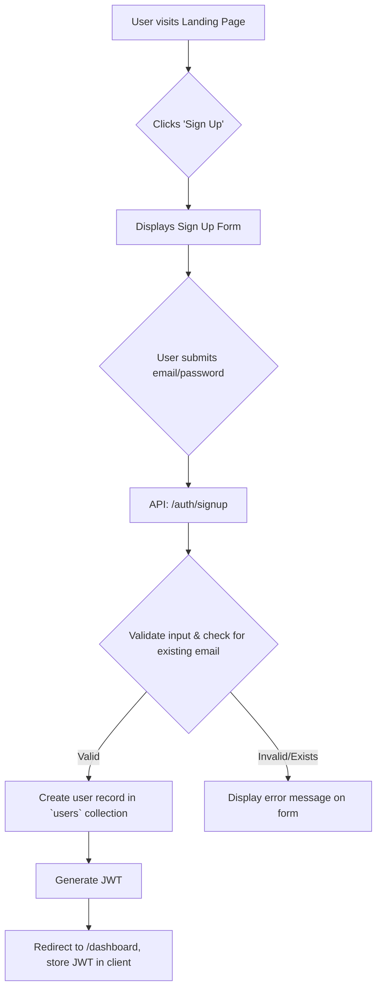

# System & User Flows

This document details the critical process flows within the Blanky-App platform. Understanding these sequences is essential for both frontend and backend development to ensure a cohesive and reliable user experience.

## 1. User Flows

These flows describe the step-by-step path a user takes to accomplish a specific task.

### Flow 1.1: User Registration and Login



**Description:**
1.  The user provides their credentials on the sign-up page.
2.  The frontend sends a request to the authentication service.
3.  The service validates the data. If the email is already in use, it returns an error.
4.  If valid, a new document is created in the `users` collection (see [Database doc](./004-database.md)).
5.  A JSON Web Token (JWT) is generated and returned to the client.
6.  The client stores the JWT (e.g., in an HttpOnly cookie) and redirects the user to their new dashboard, establishing a logged-in session.

### Flow 1.2: Saving and Publishing an App

```mermaid
graph TD
    subgraph Editor UI
        A[User makes changes on canvas] --> B{Clicks 'Save' or auto-save triggers};
        B --> C[API: PUT /projects/:projectId];
        C --> D[Backend updates `draftConfig` field in `projects` document];
        D --> E[Show 'Saved' confirmation toast];
    end

    subgraph Publish Flow
        F[User clicks 'Publish'] --> G{Show confirmation modal};
        G --> H[User confirms publish];
        H --> I[API: POST /projects/:projectId/publish];
        I --> J[Backend copies `draftConfig` to `publishedConfig`];
        J --> K[Trigger asynchronous deployment job];
        K --> L[Return 'Publishing in progress' to UI];
        subgraph Deployment Service (Async)
            M[Job receives `projectId` and `publishedConfig`] --> N[Generate static HTML/JS files from config];
            N --> O[Upload assets to CDN/hosting provider];
            O --> P[Update project status to 'Published'];
            P --> Q[Send webhook/notification of success/failure];
        end
    end
```

**Description:**
1.  **Saving:** Changes made in the editor are saved frequently to the `draftConfig` object in the project's document. This is a low-latency operation that does not affect the live app.
2.  **Publishing:** When the user clicks 'Publish', the frontend calls a dedicated endpoint.
3.  The backend first copies the stable `draftConfig` to the `publishedConfig` field. This creates a snapshot of the version being deployed.
4.  An asynchronous deployment job is then triggered. This is crucial for keeping the UI responsive, as deployment can take time.
5.  The deployment service fetches the `publishedConfig`, generates the necessary static assets, and pushes them to the hosting provider (e.g., Vercel, S3/CloudFront). Upon completion, it updates the project's status and can notify the user.

## 2. System Flows

These flows describe automated processes that happen behind the scenes.

### Flow 2.1: Public Form Submission

This flow details what happens when a visitor to a user's *published* app submits a form.

1.  **Client-Side:** The end-user fills out a form on `sams-landscaping.blanky.app` and clicks 'Submit'. The form is configured to create a new record in the 'Leads' collection.
2.  **API Request:** The frontend on the published site makes a public, unauthenticated `POST` request to a generic data-ingestion endpoint, e.g., `api.blanky.app/v1/records`.
3.  **Payload:** The request body contains the `projectId`, `collectionId`, and the form data: `{ "projectId": "...", "collectionId": "...", "data": { "name": "Jane Doe", "phone": "555-1234" } }`.
4.  **API Gateway:** The request hits our API Gateway, which routes it to the appropriate Lambda function.
5.  **Validation & Authorization:**
    *   The function first queries the `collections` document using the provided `collectionId`.
    *   It verifies that the collection belongs to the provided `projectId`.
    *   It validates the incoming `data` payload against the schema defined in the collection's `fields` array. If data is missing or of the wrong type, it rejects the request with a `400 Bad Request` error.
6.  **Database Write:** If validation passes, the function creates a new document in the `records` collection with the provided data.
7.  **Response:** The function returns a `201 Created` status to the client, which can then display a success message.

## 3. Error Handling

-   **Client-Side Errors:** The frontend application will use a global error boundary to catch unexpected rendering errors. For API calls, a centralized handler will interpret HTTP status codes and display user-friendly toast notifications from our [Design System](./006-design.md). For example, a `403 Forbidden` error will result in a message like "You don't have permission to do that."
-   **Server-Side Errors:** Our backend services will use standardized error response formats. Any uncaught exceptions will be logged to a monitoring service (e.g., Sentry, CloudWatch), and a generic `500 Internal Server Error` will be returned to the client with a unique request ID for easier debugging.