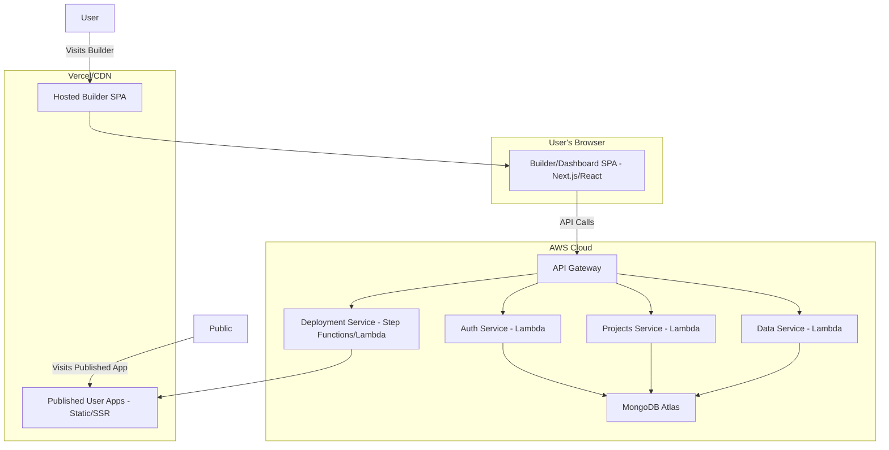

# Technical Architecture & Stack

This document provides a high-level overview of the technical architecture, technology choices, and operational strategies for building and running the Blanky-App platform.

## 1. Architecture Overview

We will adopt a **serverless, microservices-based architecture** to optimize for scalability, development velocity, and operational cost-efficiency. The system is logically divided into three main parts: the Frontend Builder, the Backend Platform API, and the Published App Delivery infrastructure.

-   **Frontend (Builder App):** A Single Page Application (SPA) built with Next.js and hosted on Vercel. This provides a rich, interactive experience for app creators.
-   **Backend API:** A set of Node.js/TypeScript microservices running on AWS Lambda. An API Gateway acts as the single entry point, routing requests to the appropriate service (e.g., authentication, project management, data handling).
-   **Database:** A managed MongoDB Atlas cluster serves as our primary data store, chosen for its flexible schema capabilities which are essential for a no-code platform. See the [Database Document](./004-database.md) for schema details.
-   **Deployment & Hosting:** The builder application is hosted on Vercel. When a user publishes an app, our Deployment Service generates the output (static files or serverless functions) and deploys it to Vercel's edge network for global low-latency access.

## 2. Technology Stack

Our technology choices prioritize developer experience, performance, and scalability.

-   **Frontend:**
    -   **Framework:** Next.js (with React 18)
    -   **Language:** TypeScript
    -   **Styling:** Tailwind CSS
    -   **State Management:** Zustand (for its simplicity and minimal boilerplate)
    -   **Drag & Drop:** React DnD
    -   **Data Fetching:** SWR (Stale-While-Revalidate)

-   **Backend:**
    -   **Runtime:** Node.js (LTS version)
    -   **Language:** TypeScript
    -   **Framework:** Express.js (for consistent routing within Lambda handlers)
    -   **Database ORM/ODM:** Mongoose
    -   **Authentication:** Auth0 (to offload complex user management, social logins, and security)

-   **Infrastructure & DevOps:**
    -   **Cloud Provider:** AWS (for Lambda, API Gateway, S3) & Vercel (for frontend and published app hosting)
    -   **Database:** MongoDB Atlas
    -   **CI/CD:** GitHub Actions
    -   **Infrastructure as Code (IaC):** Terraform
    -   **Monitoring:** Sentry (for error tracking) and AWS CloudWatch (for logs and metrics)

## 3. API Design

We will follow RESTful principles for our internal and external APIs. All responses will be in JSON format.

**Key API Endpoints (Platform API):**

-   `POST /auth/signup`: Create a new user account.
-   `POST /auth/login`: Authenticate a user and return a JWT.
-   `GET /projects`: List all projects for the authenticated user.
-   `POST /projects`: Create a new project.
-   `GET /projects/:projectId`: Retrieve the full `draftConfig` for a project.
-   `PUT /projects/:projectId`: Update the `draftConfig` for a project (i.e., save changes).
-   `POST /projects/:projectId/publish`: Trigger the deployment process for a project.
-   `GET /projects/:projectId/collections`: List all data collection schemas for a project.
-   `POST /projects/:projectId/collections`: Create a new collection schema.

**Public Data API (for Published Apps):**

-   `POST /v1/records`: Publicly accessible endpoint to create a new record in a specific collection. Requires `projectId` and `collectionId` in the payload for routing and validation.
-   `GET /v1/records?collectionId=<id>`: Publicly accessible endpoint to retrieve records from a collection.

## 4. Deployment Strategy

-   **CI/CD:** Our pipeline will be managed with GitHub Actions. Every push to the `main` branch will trigger a workflow that runs linting, type-checking, and automated tests (Jest/React Testing Library for frontend, Vitest for backend).
-   **Frontend Deployment:** On a successful build of the `main` branch, the frontend builder application will be automatically deployed to Vercel.
-   **Backend Deployment:** The same workflow will use Terraform to package and deploy the Lambda functions and update the API Gateway configuration in AWS.
-   **User App Deployment:** The 'Publish' flow described in the [Flows Document](./005-flows.md) is a separate, application-level deployment process. It is triggered via an API call, not by a Git commit.